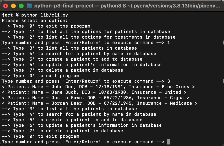

# Phase 3 CLI+ORM Final Project

# Name - MD Database

## Description

This is a very simple command line interface (CLI) built using python & SQL utilizing ORM classes/methods. It was created to simulate a doctor's office that uses a CLI to manage its patients and treatments. For these purposes, it is assumed that a doctor's office has many patients; and they can only undergo a single treatment at a time. Therefore, it utilizes a one-to-many relationship with the treatments/patients, respectively. 
The patient and treatment classes contain each contain mulitple properties and instance/class methods to help with the CLI function. As a user, you are able to accomplish many tasks such as: listing all the current patients/treatments, updating patients/treatments, deleting patients/treatments, and seeing which patients are associated with a particular treatment. 

## Usage

Local Seed.py file used to seed database for demonstration 

## Acknowledgements

I would like to thank all of the Flatiron phase leaders, technical coaches, fellow students, and all others not mentioned here but who were extremely influential for all your help reaching this milestone. It could not have been done without you. 

## Project Status

 This project is currently under development.
